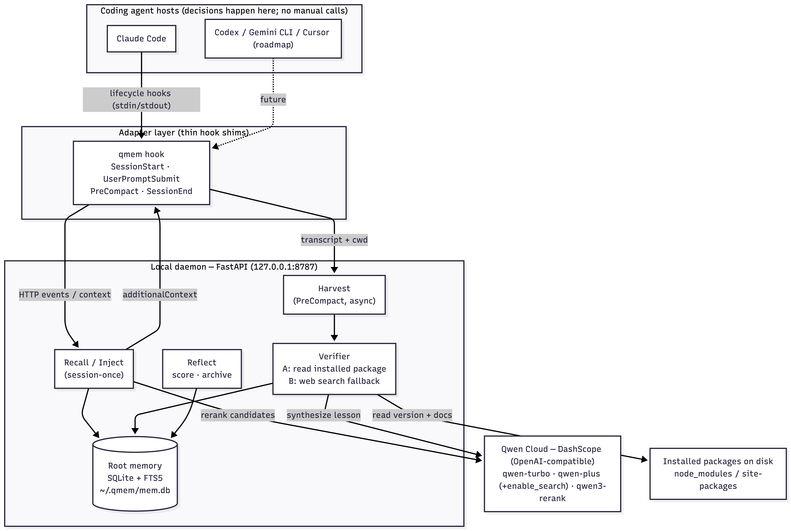
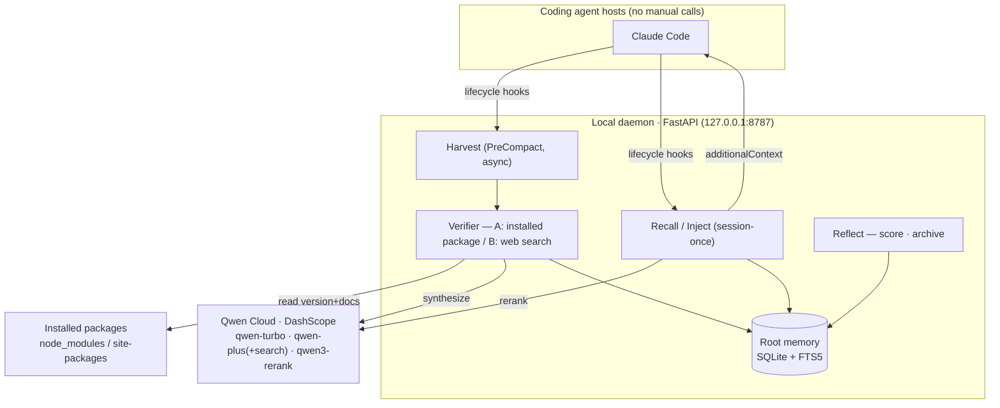

# Qwen MemoryAgent

> **Global AI Hackathon Series with Qwen Cloud — Track 1: MemoryAgent**
> A **self-correcting** memory that stops coding agents from repeating stale-knowledge
> library mistakes — across sessions and across tools. Powered by Qwen Cloud.

[](https://pypi.org/project/qwen-memory-agent/)

```bash
uv tool install qwen-memory-agent && qmem install   # macOS / Claude Code
```

---

## Problem

AI coding agents reason from **stale training knowledge** and don't web-search by default,
so they keep using removed/outdated library APIs. The decisive pain: even after you correct
a mistake once, **the next session — or a different tool — doesn't know.** You fall into the
same trap again and again.

## What it does

> Your coding agent uses stale APIs because it never web-searches. This memory catches the
> mistake **at compaction time** — reads the **actually-installed package version on disk** to
> confirm the fix — and **auto-injects it into every future session, once per session.** Wrong
> lessons demote and get forgotten.

The core isn't storage — it's **(1) mistake harvesting · (2) version-exact verification ·
(3) host-invisible injection · (4) self-correction**.

---

## Architecture (summary — source of truth in [`CONTEXT.md`](./CONTEXT.md))



<details><summary>Mermaid source</summary>


</details>

<details><summary>text version</summary>

```
HOSTS (they decide; memory stays invisible)
  Claude Code · Codex · Gemini CLI · Cursor · ...
       │ lifecycle hooks
  ADAPTER LAYER  (thin per-platform hook shims)
       │ HTTP localhost
  LOCAL DAEMON  ── Ingress · Recall · Harvest · Reflect
       ├─ MEMORY STORE  SQLite+FTS5  (~/.qmem/mem.db)
       │     L1 Curated(always injected) · L2 Episodic(raw/FTS5) · L3 Scored(lesson/rerank)
       ├─ Verifier   A: read installed package (primary) / B: web search (fallback)
       └─ LLM Provider  Qwen by default (qwen-turbo/plus/qwen3-rerank) · pluggable
```
</details>

### 5-stage pipeline

```
①HARVEST  PreCompact hook → transcript+error logs → qwen-turbo extracts candidates [async]
②VERIFY   read installed package (A, primary) → else web search (B) → qwen-plus synthesizes the fix [async]
③STORE    lesson + FTS5 index + contradiction check (conflict → stale)
④INJECT   SessionStart/UserPromptSubmit hooks → auto-inject, once per session (LLM-invisible)
⑤REFLECT  outcome signal (test pass/fail) → update score → archive/prioritize ↺①
```

`score = confidence × recency_decay(last_used) × (success+1)/(success+fail+2)`
*(reliability uses Beta(1,1) smoothing — new lessons start at 0.5 and move both ways. The
naive `success/(s+f+1)` degenerates to 0 for new lessons.)*

---

## What makes it different (vs claude-mem · agentmemory · context-mode)

Existing tools "compress and replay the conversation". Our wedge:

| | This project | Existing tools |
|---|---|---|
| Verification | **reads the installed package — version-exact** (no hallucination) | conversation summary |
| Learning | **scored Reflect self-correction** (wrong lessons demoted) | none |

The plumbing (hooks, auto-detect, multi-platform) reuses prior-art patterns; our effort
goes into those two.

---

## Multi-platform

**Implemented now:** `qmem install` wires Claude Code (Tier 1) hooks (SessionStart /
UserPromptSubmit / PreCompact / SessionEnd) — full loop. The daemon is platform-neutral
(HTTP), so other hosts just need an adapter.

**Roadmap:** scan config paths to auto-detect installed platforms + interactive selection +
tier-based wiring. Integration capability differs per platform:

```
TIER 1 hooks  full loop (auto-inject + harvest)  ← Claude Code [done] · Gemini CLI · Cursor · Copilot CLI · Kiro
TIER 2 MCP    expose recall as an MCP tool        ← Zed · OpenCode · VS Code Copilot · JetBrains ...
TIER 3 rules  static pointer in AGENTS.md         ← Aider · Cline · Goose · Warp ...
```

---

## Qwen models (pluggable, Qwen by default)

| Use | Model |
|---|---|
| Mistake-candidate extraction (bulk) | `qwen-turbo` |
| Verification / lesson synthesis (+search) | `qwen-plus` (`enable_search`) |
| Recall reranking | `qwen3-rerank` |
| L2 keyword search | no LLM (FTS5) |

**Qwen → full stack; other providers → core only (rerank/web-search degrade).**
**API**: OpenAI-compatible — `base_url=https://dashscope-intl.aliyuncs.com/compatible-mode/v1`

---

## Judging-criteria mapping

| Criterion | Implementation |
|---|---|
| Efficient storage/retrieval | L2 FTS5 (zero embedding cost) + L3 scored ranking + qwen3-rerank |
| Timely forgetting | contradiction → stale + score decay → archive + consolidation |
| Recall within limited context | L1 token cap + rerank top-K + once-per-session injection |
| **Increasingly accurate** | installed-package verification + Reflect success/fail scoring |

---

## Build phases

- [x] **P1** — SQLite+FTS5 schema, lesson CRUD/recall (L2/L3) — #2 #3
- [x] **P2** — Claude Code adapter: SessionStart/UserPromptSubmit injection (once per session) — #5 #6 #7
- [x] **P3** — PreCompact harvest → Verifier (package tearing, A) → lesson synthesis — #8 #9
- [x] **P4** — Reflect scoring loop + web-search fallback (B) *(the differentiator)* — #4 #10 #11
- [x] **P5** — demo scenario + confidence visualization — #12
- [~] **P6** — installer: Claude Code (Tier1) hooks + launchd daemon + `qmem` CLI + **PyPI release** done / multi-platform auto-detect & interactive is next

> Core (P1–P5) complete · **PyPI v0.1.0 released** · `uv run pytest` **52 passed** ·
> `uv run python demo/run_demo.py` runs the cross-session learning demo.

---

## Install (Claude Code)

**PyPI (recommended)** — no clone needed:
```bash
uv tool install qwen-memory-agent   # or: pipx install qwen-memory-agent
qmem install                        # wire hooks + start daemon
# put QWEN_API_KEY in ~/.qmem/.env, then: qmem install (re-run) or restart the daemon
```
Commands: `qmem install` / `qmem uninstall` / `qmem status` / `qmem daemon` / `qmem hook`

**From the repo (development)** — one script:
```bash
git clone https://github.com/Mrbaeksang/qwen-memory-agent && cd qwen-memory-agent
cp .env.example .env   # put in QWEN_API_KEY
./install.sh           # uv sync + qmem install (idempotent)
```

Uninstall: `qmem uninstall` (or `./uninstall.sh`). Wipe memory entirely: `rm -rf ~/.qmem`.

The daemon listens on `127.0.0.1:8787`; root memory lives at `~/.qmem/mem.db`. From then on,
every Claude Code session auto-injects relevant fixes on SessionStart/UserPromptSubmit and
harvests + verifies mistakes on PreCompact. The LLM key is loaded from `~/.qmem/.env`
(`QWEN_API_KEY`; the repo `.env` is a fallback in dev). Currently macOS/launchd.

### Develop / test

```bash
uv sync && uv run pytest      # 52 tests (Seam 1 daemon HTTP API + Seam 2 adapter contract)
uv run python demo/run_demo.py   # offline cross-session demo (zero network)
```
Release: bump version in `pyproject.toml`, then `git tag vX.Y.Z && git push origin vX.Y.Z` →
GitHub Actions (OIDC) publishes to PyPI.

---

## Demo scenario

1. **Session 1 (Claude Code)**: the agent uses a sync `Session` with SQLAlchemy 2.0 async →
   asyncpg `another operation in progress` error → compaction harvests it → reads the installed
   `sqlalchemy==2.x` and verifies the fix (AsyncSession + savepoint) → **lesson stored**.
2. **Restart (cross-session) → Session 2**: same task → SessionStart auto-injects the lesson →
   the agent gets it right from the start → **zero errors**.
3. An old lesson turns out wrong (errors again) → fail++ → confidence drops → **stale / archived**.
4. Confidence bars visualize "it's learning".

---

## References

- omp memory design: https://github.com/can1357/oh-my-pi/blob/main/docs/memory.md
- Hermes Agent: https://yuv.ai/blog/hermes-agent
- prior art: [claude-mem](https://github.com/thedotmack/claude-mem) · [agentmemory](https://github.com/rohitg00/agentmemory) · [context-mode](https://github.com/mksglu/context-mode) · [ruler](https://github.com/intellectronica/ruler)
- "Hindsight is 20/20" (arXiv 2512.12818): https://arxiv.org/abs/2512.12818
- Qwen Cloud Hackathon: https://qwencloud-hackathon.devpost.com/
